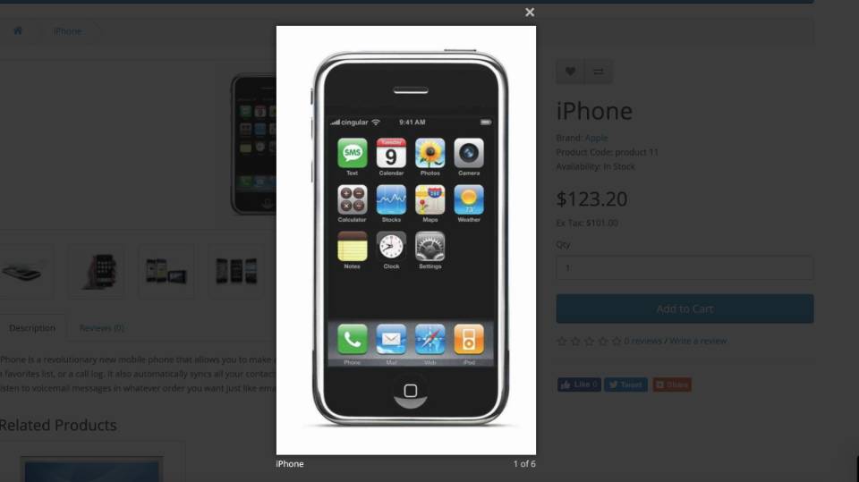

# FOC:Image flexible size ocmod

Ocmod with backward compatibility for getting more control at image cropping. Can be used to get image with it’s original size.

Opencart support: version 2.3 and higher.

Default resize logic built on scaling image by it’s minimal side and putting the result into a fixed size container.

In most cases this behaviour expected and correct, but there are two limitations:

1. It’s not possible to output images with their original size
1. You cannot control which side must be used for scale
1. This simple ocmod solve those problems.

Control is very simple:

1. To disable resize and output image as is just add 0 (zero) as a prefix in your theme image size settings
1. To force scale by width – prefix your height with zero
1. To force scale by height – prefix your width

Example settings:

Result:

## Backward compatibility

You can safely enable/disable this ocmod, since Opencart translate these sizes in integers, so 0500 become 500 with disabled module.